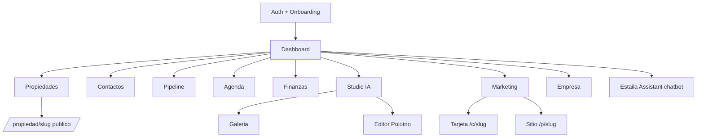

# estaila — Contexto del Proyecto

> [!abstract] Qué es
> **estaila** es un SaaS que combina un **CRM inmobiliario** con un **Studio de IA** para staging virtual y marketing. Permite a agentes que no pueden pagar fotógrafos, home stagers ni equipos de marketing producir fotos fotorrealistas y contenido en segundos, y gestionar todo su negocio (propiedades, contactos, pipeline, finanzas) desde un solo lugar.
> Origen LATAM / República Dominicana, hoy enfocado **global**. Dominios: `estaila.com` · `estaila.ai`.

## Pilares del producto

- **Ultra simplicidad** y velocidad (diseñado incluso para flujos tipo TDAH: pocos pasos, progreso visual).
- **Fotorrealismo** preservando estructura arquitectónica.
- **Automatización** y reducción extrema de costos operativos.
- Sensación de *"Canva + ChatGPT + Virtual Staging + Marketing IA"* para agentes.

## Stack técnico

> [!info] Tecnologías
> - **Framework**: Next.js 16 (App Router + Turbopack + RSC streaming), React 19
> - **UI**: Tailwind v4, shadcn/ui, `motion/react`, Lucide icons
> - **DB**: Prisma 7 + adapter `PrismaLibSql` → **Turso** (libSQL/SQLite)
> - **Auth**: Better-Auth 1.6 (scrypt) + Google OAuth + reset password
> - **Hosting**: Vercel · **Storage**: Vercel Blob
> - **IA texto**: DeepSeek (`deepseek-chat`) — bios, copy, chatbot
> - **IA imagen**: Gemini `gemini-flash-latest` (visión) + `gemini-2.5-flash-image` ("Nanobanana")
> - **Email**: Resend · **Mapas**: Mapbox · **Editor**: Polotno
> - **Backup**: GitHub Actions diario → Google Drive (rclone)

## Mapa de módulos

### Detalle por módulo

| Módulo | Qué hace | Rutas clave |
|---|---|---|
| [[Propiedades]] | CRUD + Smart Hub (Overview/Social Kit/Landing/Analytics/Docs/Rental) + landing pública | `/propiedades`, `/propiedad/[slug]` |
| [[Contactos]] | CRM con tags, smart lists, timeline, pipeline, duplicados, WhatsApp | `/contactos`, `/contactos/[id]` |
| [[Pipeline]] | Kanban de ventas, 4 vistas (Kanban/Lista/Forecast/Stats) | `/pipeline` |
| [[Agenda]] | Calendario Day/Week/Month/Year | `/agenda` |
| [[Finanzas]] | Ingresos/gastos, facturas legales PDF | `/finanzas` |
| [[Studio IA]] | 8 herramientas de edición IA + galería + editor | `/studio/*` |
| [[Marketing]] | Posts, tarjetas digitales, kits sociales | `/marketing`, `/c/[slug]` |
| [[Sitio Público]] | Portal del agente, 4 plantillas | `/sitio`, `/p/[slug]` |
| [[Empresa]] | Branding, equipo, dominio, facturación | `/empresa` |
| Soporte | Tickets + política reembolsos + chatbot escalación | `/soporte`, `/legal/reembolsos` |

## Studio IA — la "fábrica" de fotos

> [!example] Pipeline tipo fábrica
> Cada foto pasa por departamentos: el **output de una herramienta alimenta a la siguiente** (Zustand store + sessionStorage). Ej: elimino objetos → la imagen sin objetos pasa a cambiar estilo → etc.

Herramientas: ==Virtual Staging==, Eliminar Objetos, Mejorar Calidad, Cambiar Estilo, Cielo Despejado, Atardecer, Piscina, Césped.

- **Pincel mágico** (mask brush): pinta la zona a editar; se envía la máscara a Gemini como 2.ª imagen (white = modificar, black = preservar).
- **Continuidad multi-edición**: prompt maestro + se envían **original + versión actual** para que las 5 ediciones se vean como evolución de la misma foto (no escena nueva).
- **Galería** (`/studio/galeria`): filtros por herramienta, vistas estilo iOS (cuadrícula/tarjetas + zoom), agrupación por fecha, lightbox. Acciones: descargar (modal), mover a propiedad, compartir, eliminar.
- **Análisis IA**: Gemini Vision detecta habitación/estilo/buyer y auto-aplica recomendaciones al sidebar.

## Estaila Assistant (chatbot DeepSeek)

> [!tip] Lee los datos del propio agente
> Antes solo recibía conteos. Ahora un **snapshot híbrido** (scoped a `userId`) le da: perfil, links de tarjeta/sitio, contactos recientes + coincidencias por keywords, propiedades, últimas fotos, citas, finanzas del mes.
> Responde *"dame el número de Juan"*, *"mi última foto editada"*, *"link de mi tarjeta"* y devuelve chips `copy` / `external` (WhatsApp, tel, mailto, link público).

Además: wizards guiados (crear contacto/propiedad/cita), conversaciones guardadas, acciones `navigate` / `create_*`.

## Patrones de arquitectura

> [!note] Decisiones técnicas a recordar
> - **`ensureLightweightMigrations()`** — aplica `ALTER/CREATE TABLE` aditivos en el primer hit de prod (drift de Turso), antes de Better-Auth.
> - **Tagged unions** (`{ok:true,...} | {ok:false,error}`) en server actions para evitar la redacción de errores de Next 16.
> - **Gemini** v1beta usa `inlineData` (camelCase). Output a Vercel Blob (fs es read-only en serverless).
> - **DeepSeek** en JSON mode con auto-retry si devuelve vacío.
> - Imágenes públicas: dominios Blob en `next.config.ts` `remotePatterns`.

## Identidad visual

- Tema claro/oscuro con tokens **oklch**, primario **terracota** cálido.
- Fondo punteado (`bg-dots`), *ambient glow*, "soft midnight" (no negro puro).
- Estética premium tipo Notion / Linear / Arc / Airbnb.
- UI en **español (RD)**, estructurada para i18n futuro.

## Estado del roadmap

- [x] Setup + layout + schema
- [x] Propiedades, Contactos, Pipeline, Agenda, Finanzas
- [x] Studio IA (8 tools + editor + galería + pipeline)
- [x] Marketing + tarjetas + sitio público
- [x] DeepSeek (bios, copy, chatbot con contexto de usuario)
- [x] Backup diario → Google Drive
- [x] Soporte (tickets) + reembolsos + reset password + Google OAuth
- [ ] Config PayPal env vars en Vercel + webhook + planes
- [ ] Email verification config
- [ ] Deploy Vercel + DNS Cloudflare → dominio (en progreso)

## Monetización

- Tiers sugeridos: **Free / Solo $12 / Pro $29 / Team $79 / Agency $179**.
- Créditos IA por generación (Gemini ~$0.039/imagen).
- Doble pasarela: **PayPal + LemonSqueezy** coexistiendo.
- Vías extra: plantillas de sitio público premium, dominios custom.

---

> [!quote] Visión
> Que el agente sienta que tiene un equipo completo de marketing, staging, diseño y contenido — sin contratar a nadie.
